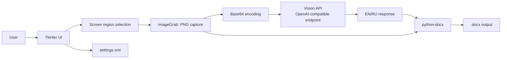
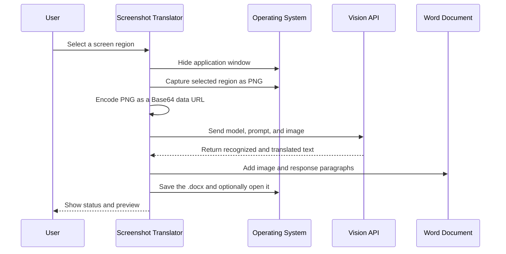

<div align="center">

# Screenshot Translator — AI Vision

<div align="center">
  <a href="./README.md">
    
  </a>
  <a href="./README.ru.md">
    
  </a>
</div>

<br><br>


[](https://www.python.org/)
[](#license)

</div>


---

# Screenshot Translator — AI Vision → Word

A Python desktop application that captures a selected screen region, sends the image to a vision model through an OpenAI-compatible API, and saves the result to a Word document. It is designed for situations where English text appears inside an image, presentation, document, remote desktop, or web interface.

## Purpose

The application reduces the manual workflow of taking a screenshot, recognizing text, translating it, and formatting the result. The user selects a screen region once and can capture it repeatedly. The vision model receives a PNG image and is instructed to return:

```text
EN: <original sentence in English>
RU: <exact Russian translation>
```

The response and the source image are saved to a `.docx` file. The user can append results to one cumulative document or create a separate document for each screenshot.

## Features

- mouse-based screen-region selection with reusable coordinates;
- temporary application hiding during capture so the UI is not included in the screenshot;
- image submission to a vision model through an OpenAI-compatible `POST /chat/completions` endpoint;
- configurable API URL, API key, model, and prompt;
- cumulative or per-screenshot Word output;
- configurable Word margins in centimeters;
- local XML settings storage;
- built-in help and response preview.

## Architecture



## Execution flow



## Requirements

- Python 3.10 or newer;
- Tkinter, normally included with Python;
- `requests`;
- `Pillow`;
- `python-docx`;
- an API key and a vision model from a compatible provider;
- Windows, macOS, or Linux. On Linux, the application uses `xdg-open` to open the generated document.

Install the dependencies:

```bash
python -m pip install requests Pillow python-docx
```

## Run the application

Save `screenshot_translator_en.py`, install the dependencies, and run:

```bash
python screenshot_translator_en.py
```

On the **API and Prompt Settings** tab, enter:

1. the compatible API URL;
2. the API key;
3. the vision model name;
4. a custom prompt if the default output format is not suitable.

Click **Save Settings**, open the **Translation** tab, select a screen region, and click **Capture Screenshot and Translate**.

## Settings and files

Settings are stored locally at:

```text
~/.screenshot_translator/settings.xml
```

On Windows, the path is usually:

```text
%USERPROFILE%\\.screenshot_translator\\settings.xml
```

The API key is not embedded in the source code. It is stored locally and sent only to the API URL configured by the user. Do not commit `settings.xml` or publish its contents.

## Output modes

In **Append to one cumulative Word document** mode, the application opens an existing `.docx` and appends a new block. In **Create a separate Word document for each screenshot** mode, the filename receives a timestamp in the `YYYYMMDD_HHMMSS` format.

Each block contains the source image, the model response, and a separator line. Top, bottom, left, and right document margins are configurable independently.

## Error handling

The application checks that a capture region, API key, and model name exist before sending a request. API errors, Word-file problems, and save errors are displayed through Tkinter dialogs. If a `.docx` file is empty or is not a valid Office Open XML package, the application creates a clean document.

## Security and limitations

Do not send confidential screenshots to an external API when organizational policy prohibits it. The image is transmitted to the provider as Base64 data inside a JSON request. The application does not currently provide personal-data masking, request auditing, retries, or encryption for the local XML settings file. These capabilities should be added before use in regulated or corporate environments.

Accuracy depends on image quality, language, and the selected vision model. The default prompt requests an `EN/RU` format, but the application does not independently validate the model response.

## Repository layout

```text
.
├── screenshot_translator_en.py          # English UI and messages
├── screenshot_translator_original_ru.py # Source supplied by the author
├── README_RU.md
├── README_EN.md
└── LINKEDIN_ARTICLE_RU.md
```

## GitHub publication checklist

Create a repository, add one README as the default entry point, and keep the second language in a separate file. Add a `.gitignore` that excludes `settings.xml`, virtual environments, and generated Word files. The API key must be supplied through local settings or an environment variable, never through a commit.

Example `.gitignore`:

```gitignore
.venv/
__pycache__/
*.py[cod]
.screenshot_translator/
*.docx
.env
```

Example publication commands:

```bash
git init
git add screenshot_translator_en.py screenshot_translator_original_ru.py README_RU.md README_EN.md LINKEDIN_ARTICLE_RU.md .gitignore
git commit -m "Add AI screenshot translator with Word export"
git branch -M main
git remote add origin https://github.com/<username>/<repository>.git
git push -u origin main
```

## License

No license was specified in the supplied source material. Add a `LICENSE` file before publication and explicitly define how the program may be used, distributed, and modified.

## References

[1]: https://docs.python.org/3/library/tkinter.html "Python tkinter documentation"
[2]: https://python-docx.readthedocs.io/en/latest/ "python-docx documentation"
[3]: https://requests.readthedocs.io/en/latest/ "Requests documentation"
[4]: https://mermaid.js.org/intro/ "Mermaid documentation"
[5]: https://platform.openai.com/docs/api-reference/chat "OpenAI-compatible chat completions API reference"

The project relies on Python Tkinter [1], `python-docx` [2], Requests [3], and Mermaid diagrams [4]. Its request shape follows an interface compatible with the Chat Completions API [5].
