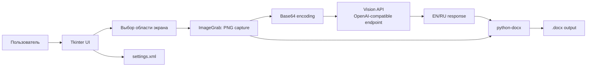
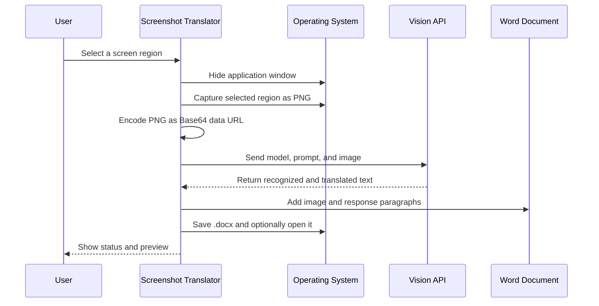

<div align="center">

# ⚡ Screenshot Translator — AI Vision

<div align="center">
  <a href="./README.md">
    
  </a>
  <a href="./README.ru.md">
    
  </a>
</div>

<br><br>


[](https://www.python.org/)
[](#license)


</div>


---


# Screenshot Translator — AI Vision → Word

Desktop-приложение на Python для захвата выбранной области экрана, распознавания текста с помощью vision-модели через OpenAI-совместимый API и сохранения результата в документ Word. Приложение ориентировано на сценарии, в которых английский (или какой нибудь другом язык) текст находится внутри изображения, презентации, документа, удалённого рабочего стола или веб-интерфейса.

## Назначение

Программа сокращает ручную цепочку «сделать скриншот → распознать текст → перевести → оформить результат». Пользователь один раз выделяет область экрана, после чего может многократно выполнять захват. Vision-модель получает PNG-изображение и возвращает результат в заданном формате:

```text
EN: <original sentence in English>
RU: <exact Russian translation>
```

Результат вместе с исходным изображением сохраняется в `.docx`. Можно использовать один накопительный документ или создавать отдельный документ для каждого скриншота.

## Возможности

- выделение области экрана мышью и повторное использование координат;
- скрытие окна приложения во время захвата, чтобы интерфейс не попал в изображение;
- передача изображения в vision-модель через OpenAI-совместимый `POST /chat/completions`;
- настраиваемый API URL, API key, model и prompt;
- накопительный или отдельный Word-документ;
- настройка полей Word в сантиметрах;
- локальное хранение настроек в XML;
- встроенная справка и предварительный просмотр ответа модели.

## Архитектура



## Поток выполнения



## Требования

- Python 3.10 или новее;
- Tkinter, обычно входящий в стандартную поставку Python;
- `requests`;
- `Pillow`;
- `python-docx`;
- API-ключ и vision-модель у выбранного совместимого провайдера;
- Windows, macOS или Linux. На Linux для автоматического открытия документа используется `xdg-open`.

Установите зависимости:

```bash
python -m pip install requests Pillow python-docx
```

## Запуск

Сохраните файл `screenshot_translator_en.py`, установите зависимости и выполните:

```bash
python screenshot_translator_en.py
```

На вкладке **API and Prompt Settings** укажите:

1. URL совместимого API;
2. API key;
3. название vision-модели;
4. prompt, если стандартный формат нужно изменить.

Нажмите **Save Settings**, перейдите на вкладку **Translation**, выберите область экрана и нажмите **Capture Screenshot and Translate**.

## Настройки и файлы

Настройки сохраняются локально в:

```text
~/.screenshot_translator/settings.xml
```

В Windows это обычно:

```text
%USERPROFILE%\\.screenshot_translator\\settings.xml
```

API key не встраивается в исходный код. Он хранится локально и отправляется только на URL, который пользователь указал в настройках. Не добавляйте файл `settings.xml` в Git-репозиторий и не публикуйте его содержимое.

## Режимы сохранения

В режиме **Append to one cumulative Word document** программа открывает существующий `.docx` и добавляет новый блок в конец. В режиме **Create a separate Word document for each screenshot** имя файла получает временную метку вида `YYYYMMDD_HHMMSS`.

Каждый блок содержит исходное изображение, текст ответа модели и разделительную линию. Поля документа задаются отдельно для верхнего, нижнего, левого и правого края.

## Обработка ошибок

Программа проверяет наличие области захвата, API key и названия модели до отправки запроса. Ошибки API, проблемы чтения Word-файла и ошибки сохранения показываются через диалог Tkinter. Если файл с расширением `.docx` пустой или не является корректным Office Open XML-пакетом, приложение создаёт новый документ.

## Безопасность и ограничения

Не отправляйте конфиденциальные скриншоты в API-провайдер, если это запрещено политикой организации. Изображение передаётся внешнему API в формате Base64 внутри JSON-запроса. Программа не реализует маскирование персональных данных, аудит запросов, повторные попытки и шифрование локального XML-файла настроек. Эти функции следует добавить перед использованием в регулируемой или корпоративной среде.

Точность зависит от качества изображения, языка и возможностей выбранной vision-модели. Стандартный prompt требует формат `EN/RU`, но приложение не выполняет отдельную валидацию ответа модели.

## Структура репозитория

```text
.
├── screenshot_translator_en.py       # английская версия интерфейса и сообщений
├── screenshot_translator_original_ru.py # исходная версия, предоставленная автором
├── README_RU.md
├── README_EN.md
└── LINKEDIN_ARTICLE_RU.md
```

## Рекомендации для публикации на GitHub

Перед публикацией создайте репозиторий, добавьте `README.md` на выбранном языке или сделайте русскую версию основной, а английскую оставьте как отдельный файл. Добавьте `.gitignore` с исключением `settings.xml`, виртуального окружения и временных Word-файлов. API key должен передаваться только через локальную настройку или переменную окружения, но не через commit.

Пример `.gitignore`:

```gitignore
.venv/
__pycache__/
*.py[cod]
.screenshot_translator/
*.docx
.env
```

Команды публикации:

```bash
git init
git add screenshot_translator_en.py screenshot_translator_original_ru.py README_RU.md README_EN.md LINKEDIN_ARTICLE_RU.md .gitignore
git commit -m "Add AI screenshot translator with Word export"
git branch -M main
git remote add origin https://github.com/<username>/<repository>.git
git push -u origin main
```

## Лицензия

Лицензия в исходных материалах не указана. Перед публикацией добавьте `LICENSE` и явно определите условия использования, распространения и изменения программы.

## References

[1]: https://docs.python.org/3/library/tkinter.html "Python tkinter documentation"
[2]: https://python-docx.readthedocs.io/en/latest/ "python-docx documentation"
[3]: https://requests.readthedocs.io/en/latest/ "Requests documentation"
[4]: https://mermaid.js.org/intro/ "Mermaid documentation"
[5]: https://platform.openai.com/docs/api-reference/chat "OpenAI-compatible chat completions API reference"

Инструменты, использованные проектом, описаны в документации Python Tkinter [1], `python-docx` [2], Requests [3] и Mermaid [4]. Формат запроса ориентирован на совместимый с Chat Completions API интерфейс [5].

### Контакты
* Email: sergeyh510@gmail.com
* GitHub: sergeyh510-alt
* LinkedIn: www.linkedin.com/in/sergey-chekryzhov-a38778217
* Telegram: @SergeyChekryzhov
